# Advanced Cluster Security for Kubernetes (ACS)
- [Advanced Cluster Security for Kubernetes (ACS)](#advanced-cluster-security-for-kubernetes-acs)
  - [Installation](#installation)
    - [Central Installation](#central-installation)
      - [[Optional] Create Central at Infra Nodes](#optional-create-central-at-infra-nodes)
      - [Access Central](#access-central)
    - [Secured Cluster Services (Managed Cluster)](#secured-cluster-services-managed-cluster)
      - [Operator](#operator)
      - [CLI roxctl and Helm](#cli-roxctl-and-helm)
      - [View Managed Cluster](#view-managed-cluster)
    - [Single Sign-On with OpenShift](#single-sign-on-with-openshift)
    - [Integration with Nexus](#integration-with-nexus)
      - [Setup Nexus](#setup-nexus)
      - [Config ACS](#config-acs)
  - [Demo](#demo)
    - [Container Image with Vulnerabilities](#container-image-with-vulnerabilities)
    - [Shift Left Security](#shift-left-security)
      - [kube-linter](#kube-linter)
      - [Scan and check image with roxctl](#scan-and-check-image-with-roxctl)
      - [Jenkins](#jenkins)
      - [CLI: roxctl](#cli-roxctl)
        - [Stackrox Jenkins Plugin](#stackrox-jenkins-plugin)
        - [Enforce Policy on Build Stage](#enforce-policy-on-build-stage)
    - [Detecting suspect behaviors](#detecting-suspect-behaviors)
      - [Exec into Pod](#exec-into-pod)

## Installation

### Central Installation

- Install Operator 
  
  - Select *Advanced Cluster Security for Kubernetes* 


  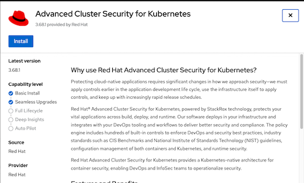


  - Accept default parameters

  
  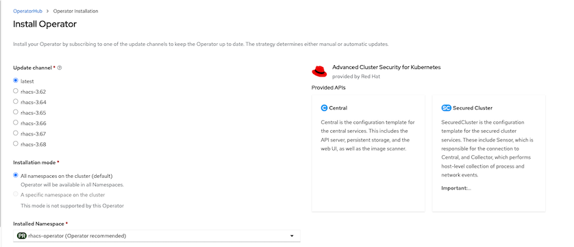

  
- Create namespace for central server and scanner.

  ```bash
  oc new-project stackrox
  ```

- Install *roxctl* CLI
  - Download latest binary from [here](https://mirror.openshift.com/pub/rhacs/assets/latest/bin/)
    
    - For OSX
      
      ```bash
      curl -O https://mirror.openshift.com/pub/rhacs/assets/latest/bin/Darwin/roxctl
      ```

- Create ACS Central with [acs-central.yaml](manifests/acs-central.yaml)
  
  - If you want to use custom certificate storedfor central add following section to [acs-central.yaml](manifests/acs-central.yaml)
  
    ```yaml
    spec:
      central:
        defaultTLSSecret:
          name: acs-central
    ```

    <!-- - *Optional:* Copy default TLS from default router to secret name *acs-central*
    
      ```bash
      oc get secret $(oc get secret -n openshift-ingress -o=custom-columns="NAME:.metadata.name" --no-headers | grep ingress-certs) -n openshift-ingress -o yaml | sed 's/namespace: .*/namespace: stackrox/' | sed 's/name: .*/name: acs-central/' | oc apply -n stackrox  -f -
      ``` -->

- Create Central

  ```bash
  oc create -f manifests/acs-central.yaml -n stackrox
  ```

  *Remark*
  - Central is configured with memory limit 8 Gi
  - Default RWO storage for central is 100 GB

- Check status
  
  ```bash
  oc describe central/stackrox-central-services -n stackrox
  watch oc get pods -n stackrox
  ```

  Output
  
  ```bash
  NAME                          READY   STATUS    RESTARTS   AGE
  central-768b975cb4-pznx2      1/1     Running   0          2m36s
  scanner-774867b7f5-vnlds      1/1     Running   0          3m17s
  scanner-db-7784db6d56-7kqvq   1/1     Running   0          3m17s
  ```

  Resources consumed by ACS central
  
  - CPU
  
    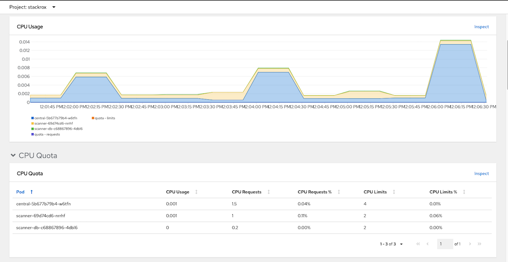

  - Memory
  
    

#### [Optional] Create Central at Infra Nodes
  - Infra Nodes preparation

    - Label Infra nodes
      
      ```bash
      oc label node <node> node-role.kubernetes.io/infra=""
      oc label node <node> node-role.kubernetes.io/acs=""
      ```
    
    - Taint infra nodes with *infra-acs*
      
      ```bash
      oc adm taint node <node> infra-acs=reserved:NoSchedule
      ```
  - Create Central with [acs-central-infra.yaml](manifests/acs-central-infra.yaml)
    
    ```bash
    oc create -f manifests/acs-central-infra.yaml -n stackrox
    ```

#### Access Central

- URL and password to access ACS Console
  
  ```bash
  ROX_URL=https://$(oc get route central -n stackrox -o jsonpath='{.spec.host}')
  ROX_CENTRAL_ADDRESS=$(oc get route central -n stackrox -o jsonpath='{.spec.host}'):443
  ROX_PASSWORD=$(oc get secret central-htpasswd -n stackrox -o jsonpath='{.data.password}'|base64 -d)
  ```

### Secured Cluster Services (Managed Cluster)

#### Operator

- Login to ACS console
- Generate cluster init bundle
  - Platform Configuration -> Integrations -> Cluster Init Bundle -> Generate Bundle

    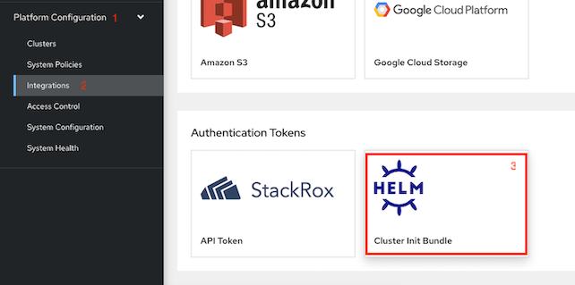

  - Input cluster name
  - download *Kubernetes Secrets file* for installation with *Operator* or *Helm values file* for installation with *roxctl*

- Create namespace for *Secured Cluster Services*
  
  ```bash
  oc new-project stackrox-cluster
  ```

- Create secret from previously downloaded *Kubernetes Secrets file*
  
  ```bash
  oc create -f cluster1-cluster-init-secrets.yaml -n stackrox-cluster
  ```

- Install Secure Cluster Services on local cluster

    - Create Secured Cluster Service with [acs-secured-cluster.yaml](manifests/acs-secured-cluster.yaml)
      
      ```bash
      oc create -f manifests/acs-secured-cluster.yaml -n stackrox-cluster
      ```

      Remark: [acs-secured-cluster.yaml](manifests/acs-secured-cluster.yaml) is prepared for install Secured Cluster Service within the same cluster with Central.

      If you want Admission Control run on Infra Nodes with [acs-secured-cluster-infra.yaml](manifests/acs-secured-cluster-infra.yaml)

      ```bash
      oc create -f manifests/acs-secured-cluster-infra.yaml -n stackrox-cluster
      ```

    - Check status
      
      ```bash
      oc describe securedcluster/cluster1  -n stackrox-cluster
      watch oc get pods -n stackrox-cluster
      ```

      Output

      ```bash
      NAME                                READY   STATUS    RESTARTS   AGE
      admission-control-cb5997c68-4ddp8   1/1     Running   0          28s
      admission-control-cb5997c68-7vtgh   1/1     Running   0          28s
      admission-control-cb5997c68-qhbqc   1/1     Running   0          28s
      collector-59kzw                     2/2     Running   0          28s
      collector-bx2w2                     2/2     Running   0          28s
      collector-kgp57                     2/2     Running   0          28s
      collector-tmscm                     2/2     Running   0          28s
      collector-x9h8n                     2/2     Running   0          28s
      ```

      Remark
      - Adminission control is high availability with default 3 pods
      - Collector is run on all nodes

  Resources consumed by admission control and collector
  
  - CPU
  
    

  - Memory
  
    

- Install Secure Cluster Services on remote cluster

    - Generate cluster init bundle
    - Create secret from previously downloaded *Kubernetes Secrets file* 
      
      ```bash
      oc new-project stackrox-cluster
      oc create -f cluster2-cluster-init-secrets.yaml -n stackrox-cluster
      ```

    - Create Secured Cluster Service with centralEndpoint set to Central's route. 
      
      Get Central's route and save to ROX_HOST environment variable

      ```bash
      ROX_HOST=$(oc get route central -n stackrox -o jsonpath='{.spec.host}')
      ```

      Login to remote cluster and run following command.

      ```bash
      cat manifests/acs-secured-cluster.yaml | \
      sed s/central.stackrox.svc/$ROX_HOST/ | \
      sed s/cluster1/cluster2/ | \
      oc create -n stackrox-cluster -f - 
      ```

#### CLI roxctl and Helm

- Create *authentication token*
  
  - Login to Central
    
    ```bash
    echo "ACS Console: https://$(oc get route central -n stackrox -o jsonpath='{.spec.host}')"
    ```

  - Platform Configuration -> Integrations -> Authentication Tokens. Select StackRox API Token then generate token and copy token to clipboard
  
      

    - Token Name: admin
    - Role: Admin

- Set environment variable
    
    ```bash
    export ROX_API_TOKEN=<api-token>
    export ROX_CENTRAL_ADDRESS=$(oc get route central -n stackrox -o jsonpath='{.spec.host}'):443
    ```

- Add Helm repository
  
  ```bash
  helm repo add rhacs https://mirror.openshift.com/pub/rhacs/charts/
  ```

- Install Secure Cluster Services on local cluster

    - Generate cluster init bundle
    
      ```bash
      CLUSTER_NAME=cluster1
      roxctl --insecure-skip-tls-verify -e "$ROX_CENTRAL_ADDRESS" central init-bundles generate $CLUSTER_NAME \
      --output $CLUSTER_NAME-init-bundle.yaml
      ```

      Example of output

      ```
      INFO:	Successfully generated new init bundle.

        Name:       cluster1
        Created at: 2022-05-22T07:43:47.645062387Z
        Expires at: 2023-05-22T07:44:00Z
        Created By: admin
        ID:         84c50c04-de36-450d-a5d6-7a23f1dd563c

      INFO:	The newly generated init bundle has been written to file "cluster1-init-bundle.yaml".
      INFO:	The init bundle needs to be stored securely, since it contains secrets.
      INFO:	It is not possible to retrieve previously generated init bundles.
      ```

    - Create collectors
      
      ```bash
      helm install -n stackrox-cluster --create-namespace stackrox-secured-cluster-services rhacs/secured-cluster-services \
      -f ${CLUSTER_NAME}-init-bundle.yaml \
      --set clusterName=${CLUSTER_NAME} \
      --set imagePullSecrets.allowNone=true
      ```
    
-  Install Secure Cluster Services on Remote cluster
  
     - Generate cluster init bundle
     
       ```bash
       CLUSTER_NAME=cluster2
       roxctl --insecure-skip-tls-verify -e "$ROX_CENTRAL_ADDRESS" central init-bundles generate $CLUSTER_NAME \
       --output $CLUSTER_NAME-init-bundle.yaml
       ```

     - Create collectors
       
       ```bash
       helm install -n stackrox --create-namespace stackrox-secured-cluster-services rhacs/secured-cluster-services \
       -f ${CLUSTER_NAME}-init-bundle.yaml \
       --set centralEndpoint=${ROX_CENTRAL_ADDRESS} \
       --set clusterName=${CLUSTER_NAME} \
       --set imagePullSecrets.allowNone=true
       ```

 - Check collector pods
  
    ```bash
    oc get pods -n stackrox -l app=collector,app.kubernetes.io/name=stackrox
    ```

    Output
    
    ```bash
    NAME              READY   STATUS    RESTARTS   AGE
    collector-5hmzt   2/2     Running   0          87s
    collector-dmpps   2/2     Running   0          87s
    collector-ffpdg   2/2     Running   0          87s
    collector-rfkq2   2/2     Running   0          87s
    collector-x4gtb   2/2     Running   0          87s
    ```

#### View Managed Cluster   

- Check ACS Console

  - Dashboard

    

  - Platform Configuration -> Clusters

    

    
    Overall status


    
    

    Dynamic configuration

    

    Helm-managed cluster

    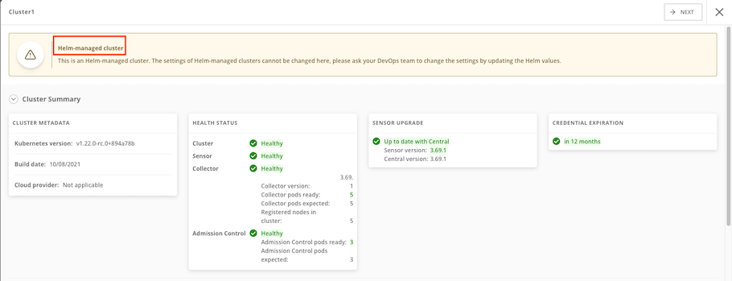

### Single Sign-On with OpenShift
- Navigate to Platform Configuration -> Access Control then click Add Auth Provider and select OpenShift Auth

    

- Input configuration then click save
  - Name: OpenShift
  - Minium access role: Analyst
  - Rules: mapped spcific user to Admin role

    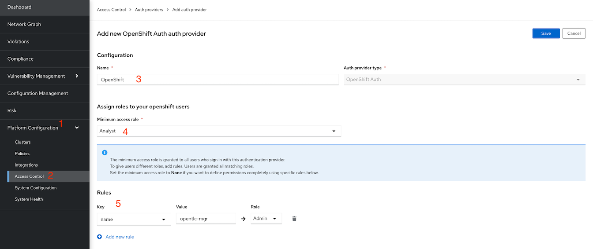
  
  - Login with OpenShift

    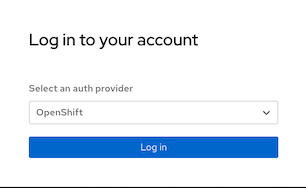

### Integration with Nexus
#### Setup Nexus
- Create namespace
  
  ```bash
  oc new-project ci-cd
  ```
- Create nexus
  
  ```bash
  cd bin
  ./setup_nexus.sh
  ```

  Example of output

  ```bash
  expose port 5000 for container registry
  service/nexus-registry exposed
  route.route.openshift.io/nexus-registry created
  NEXUS URL = nexus-ci-cd.apps.cluster-**tlc.com
  NEXUS User admin: *****
  NEXUS User jenkins: **********
  Nexus password is stored at nexus_password.txt
  ```

- Login to nexus with user admin and initial password and set new admin password.
- Browse repository
  

- Copy sample container images to nexus

  ```bash
  NEXUS=$(oc get route nexus-registry -n ci-cd -o jsonpath='{.spec.host}')
  allImages=(backend:v1 backend:11-ubuntu backend:CVE-2020-36518 frontend-js:v1 frontend-js:node frontend-js:CVE-2020-28471 log4shell:latest backend-native:v1 backend-native:distroless)
  for image in $allImages
  do
    echo "############## Copy $image ##############"
    podman run docker://quay.io/skopeo/stable:latest \
    copy --src-tls-verify=true \
    --dest-tls-verify=false \
    --src-no-creds \
    --dest-username admin \
    --dest-password $NEXUS_PASSWORD \
    docker://quay.io/voravitl/$image \
    docker://$NEXUS/$image
    echo "##########################################"
  done
  ```

  Check Nexus docker repository

  


#### Config ACS 
- Login to ACS Central
- Platform Configuration -> Integrations -> Sonatype Nexus -> New Integration
  
  Check for Nexus Container Registry address
  
  ```bash
  echo "Endpoint: $(oc get route nexus-registry -n ci-cd -o jsonpath='{.spec.host}')"
  ```

  

  - Input User, Password and Nexus Registry address then click Test and Save

## Demo

### Container Image with Vulnerabilities

- Deploy sample application

    ```bash
    oc new-project test
    oc run log4shell --labels=app=log4shell --image=$(oc get route nexus-registry -n ci-cd -o jsonpath='{.spec.host}')/log4shell:latest -n test
    oc run backend --labels=app=CVE-2020-36518 --image=$(oc get route nexus-registry -n ci-cd -o jsonpath='{.spec.host}')/backend:CVE-2020-36518 -n test
    watch oc get pods -n test
    ```

- Check ACS Dashboard. 
  
  - 1 Criticals violation will be found.
    
    

  - Drill down for more information


    


    CVE Information
    

    


    CVSS score: https://nvd.nist.gov/vuln-metrics/cvss

- Search by CVE. Vulnerability Management -> Dashboard -> IMAGES -> Search for *CVE-2021-44228*


  


  Details information


  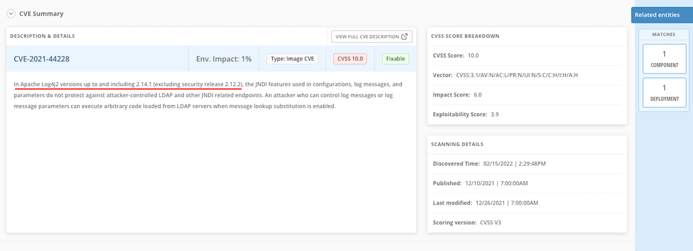

- Naviate to Violations, You will find Fixable at least important that is alert for deployment with fixable vulnerbilities on backend deployment
  
  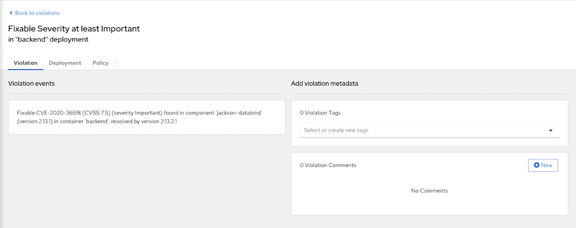

  Affected deployment

  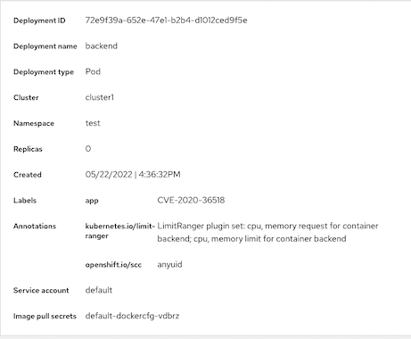

  Drilled down to integrated nexus

  

### Shift Left Security
#### kube-linter

- Try kube-linter with deployment YAML
  
  ```bash
  kube-linter lint manifests/backend-bad-example.yaml
  ```
  
  Download kube-linter from this [link](https://github.com/stackrox/kube-linter/releases)

- Sample recommendation
  
  ```
  manifests/backend-bad-example.yaml: (object: <no namespace>/backend-v2 apps/v1, Kind=Deployment) container "backend" is not set to runAsNonRoot (check: run-as-non-root, remediation: Set runAsUser to a non-zero number and runAsNonRoot to true in your pod or container securityContext. Refer to https://kubernetes.io/docs/tasks/configure-pod-container/security-context/ for details.)

  manifests/backend-bad-example.yaml: (object: <no namespace>/backend-v2 apps/v1, Kind=Deployment) container "backend" has cpu request 0 (check: unset-cpu-requirements, remediation: Set CPU requests and limits for your container based on its requirements. Refer to https://kubernetes.io/docs/concepts/configuration/manage-resources-containers/#requests-and-limits for details.)
  ```

- Try kube-linter with [backend-v1.yaml](manifests/backend-v1.yaml)
  
  ```bash
  kube-linter lint manifests/backend-v1.yaml
  ```

  Output

  ```bash
  manifests/backend.yaml: (object: <no namespace>/backend-v1 apps/v1, Kind=Deployment) container "backend" does not have a read-only root file system (check: no-read-only-root-fs, remediation: Set readOnlyRootFilesystem to true in the container securityContext.)
  ```
  
  Container "backend" still does not have a read-only root file system because Vert.X still need to write /tmp then try [backend deployment with emptyDir](manifests/backend-v1-emptyDir.yaml)

  Try agin with [backend-v1-emptyDir.yaml](manifests/backend-v1-emptyDir.yaml) which set *readOnlyRootFilesystem* to *true*

  ```bash
  kube-linter lint manifests/backend-v1-emptyDir.yaml
  ```

  Output

  ```bash
  KubeLinter 0.3.0

  No lint errors found!
  ```

#### Scan and check image with roxctl

- Create token for DevOps tools
    
   - Navigate to Platform Configuration -> Integrations -> Authentication Token -> API Token
   - Click Generate Token
   - Input token name and select role Continuous Integration
   - Copy and save token.

- Set API token to environment variable 

  ```bash
  export ROX_API_TOKEN=<token>
  ROX_CENTRAL_ADDRESS=$(oc get route central -n stackrox -o jsonpath='{.spec.host}'):443
  ```
- Scan image to check for vulnerbilities
  
  ```bash
  roxctl --insecure-skip-tls-verify -e "$ROX_CENTRAL_ADDRESS" image scan --image $(oc get -n ci-cd route nexus-registry -o jsonpath='{.spec.host}')/backend:v1 --output=table
  roxctl --insecure-skip-tls-verify -e "$ROX_CENTRAL_ADDRESS" image scan --image $(oc get -n ci-cd route nexus-registry -o jsonpath='{.spec.host}')/backend:CVE-2020-36518 --output=json| jq '.result.summary.CRITICAL'
  ```

  Scan all images in Nexus registry

  ```bash
  ROX_CENTRAL_ADDRESS=$(oc get route central -n stackrox -o jsonpath='{.spec.host}'):443
  allImages=(backend:v1 backend:11-ubuntu backend:CVE-2020-36518 frontend-js:v1 frontend-js:node frontend-js:CVE-2020-28471 log4shell:latest backend-native:v1 backend-native:distroless)
  for image in $allImages
  do
      roxctl --insecure-skip-tls-verify -e "$ROX_CENTRAL_ADDRESS" image scan --image $(oc get -n ci-cd route nexus-registry -o jsonpath='{.spec.host}')/$image --output=table
  done
  ```

  Resources comsumed by ACS Central

  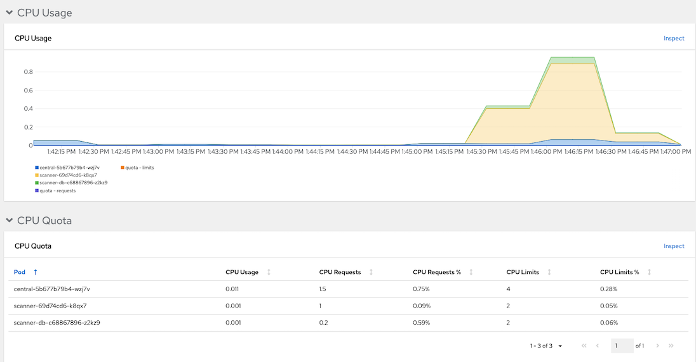
 
- Check images in image registry
  
  - Stackrox can check for vulnerbilities in libraries used by Java applicaion. Check for image backend:CVE-2020-36518
  
    ```bash
    roxctl --insecure-skip-tls-verify \
    -e "$ROX_CENTRAL_ADDRESS" image check \
    --image $(oc get -n ci-cd route nexus-registry -o jsonpath='{.spec.host}')/backend:CVE-2020-36518 \
    --output=table
    ```

    Output

    

    
    Remark: Column *BREAKS BUILD* indicate that this violation will be stop build process or not

  - Image backend:v1
  
    ```bash
    roxctl --insecure-skip-tls-verify \
    -e "$ROX_CENTRAL_ADDRESS" image check \
    --image $(oc get -n ci-cd route nexus-registry -o jsonpath='{.spec.host}')/backend:v1 \
    --output=table
    ```

    Output

    

- Deployment check

  ```bash
  roxctl --insecure-skip-tls-verify -e "$ROX_CENTRAL_ADDRESS" deployment check --file=manifests/backend-bad-example.yaml
  ```

  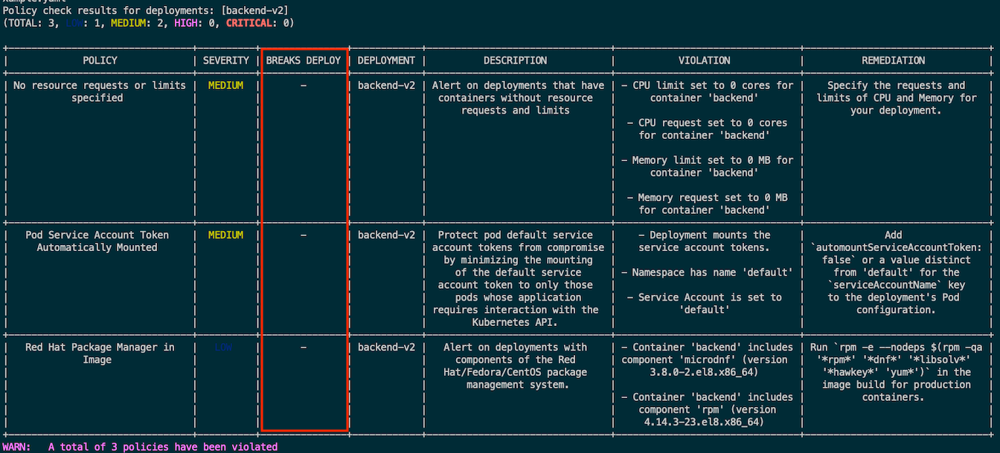

  Remark: BREAKS DEPLOY column indicate that deployment will be blocked by ACS or not

<!-- - Custom check can be added for example we want to vaidate that only scanned imaged 
  
  - Search for Policy *Required Image Label* by select menu Platform Configuration -> Policies. Enter Policy, press tab then input label. 
    

  - Clone policy
    - Input name and set severity
      
      
    
    - Set policy behavior for build time and runtime

      

    - Add criterias to check label app and version
    -  -->

<!-- - Stackrox can check for vulnerbilities in npm used by nodejs applicaion. Check for image frontend-js:CVE-2020-28471
  
    ```bash
      roxctl --insecure-skip-tls-verify -e "$ROX_CENTRAL_ADDRESS" image check --image $(oc get -n ci-cd route nexus-registry -o jsonpath='{.spec.host}')/frontend-js:CVE-2020-28471 --output=table
    ```

    Output

     -->

#### Jenkins
- Setup Jenkins and SonarQube
  
  ```bash
  cd bin
  ./setup_cicd_projects.sh
  ./setup_jenkins.sh
  ./setup_sonar.sh
  ```

  Remark: This demo need [Nexus](#setup-nexus)
  
#### CLI: roxctl

- Create buildConfig with Jenkins. 
    - Change following build configuration in [backend-build-pipeline.yaml](manifests/backend-build-pipeline.yaml) 
      - Set NEXUS_REGISTRY to Nexus Registry address
          
          ```bash
          oc get route nexus-registry -n ci-cd -o jsonpath='{.spec.host}'
          ```

      - Set STACKROX to true
      - Set MAX_CRITICAL_CVES to 0
  - Create pipelines
  
    ```bash
    oc create -f manifests/backend-build-pipeline.yaml -n ci-cd
    oc create -f manifests/backend-build-stackrox-pipeline.yaml -n ci-cd
    ```

- Create secret name stackrox-token in namespace ci-cd with Stackrox API token 
  
  ```bash
  echo "...Token.." > token
  oc create secret generic stackrox-token -n ci-cd --from-file=token
  rm -f token
  ```

- Login to Jenkins
  
  ```bash
  echo "Jenkins URL: https://$(oc get route jenkins -n ci-cd -o jsonpath='{.spec.host}')"
  ```

- Start backend-build-pipeline. Pipeline will be failed because there is 1 CRITICAL CVEs
  
  
  
- Change MAX_CRITICAL_CVE environment variable to 10 and re-run pipeline again

  

  Remark: [Jenkinsfile](https://gitlab.com/ocp-demo/backend_quarkus/-/blob/cve/Jenkinsfile/build/Jenkinsfile) for backend-build-pipeline

##### Stackrox Jenkins Plugin

- Install Stackrox plugin and restart Jenkins
  
  

- Edit NEXUS_REGISTRY and create pipeline [backend-build-stackrox-pipeline.yaml](manifests/backend-build-stackrox-pipeline.yaml)

  ```bash
  oc apply -f manifests/backend-build-stackrox-pipeline.yaml -n ci-cd
  ```

- Start backend-build-stackrox-pipeline. Pipeline will failed because image contains CVEs and violate ACS policies
  
  

- Detailed report in Jenkins
  
  

  Remark: [Jenkinsfile](https://gitlab.com/ocp-demo/backend_quarkus/-/blob/cve/Jenkinsfile/build-stackrox/Jenkinsfile) for backend-build-stackrox-pipeline

##### Enforce Policy on Build Stage
- Login to ACS Console, Select Menu Platform -> Configuration, type policy in search bar then input curl
  
  

- Select policy Curl in image and edit policy

  

- Select policy behavior
    - select inform and enforce
    - enable on build
  
    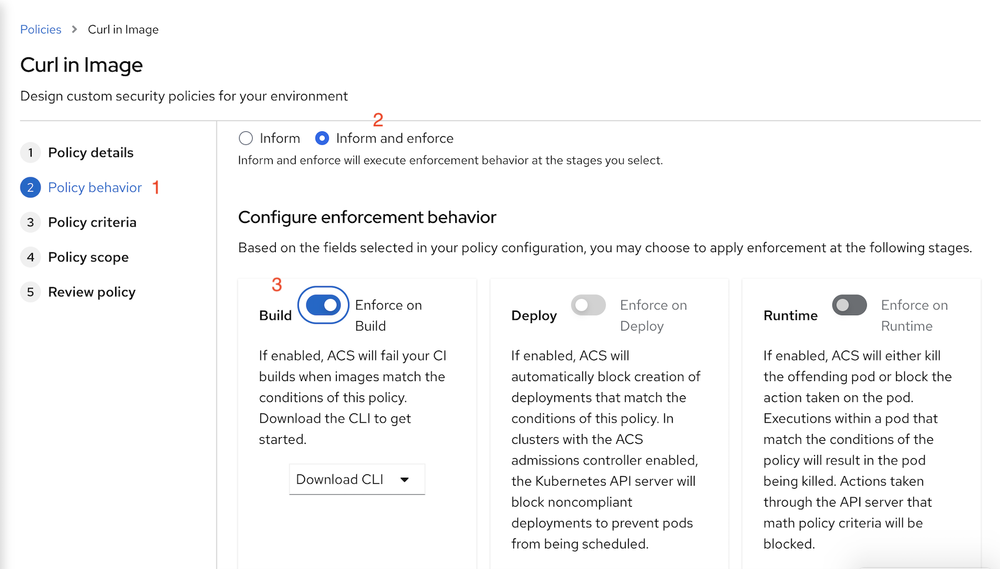

- Enable policy curl in image
    
  
  
- Re-run Jenkins pipeline backend-build-stackrox-pipeline and check for report
    
  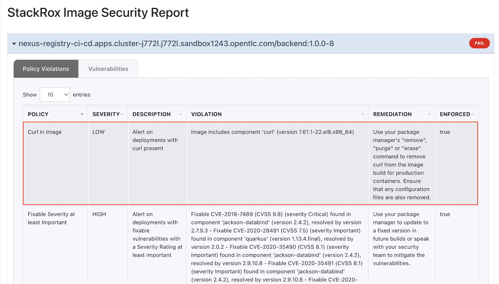

### Detecting suspect behaviors
#### Exec into Pod
- Platform configuration -> Policies
- Search for Policy Kubernetes Actions: Exec into Pod
- Click Action -> Edit Policy
- Click Next to Policy Behavior and enable Enforce on runtime. This will make ACS kill the offend pod that try to run exec.
  
  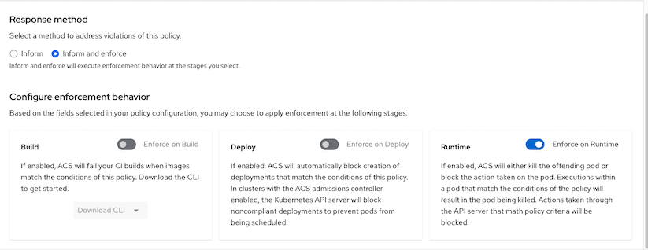

- Save Policy
- Run curl inside backend's pod
  
    ```bash
    oc new-project project1
    oc apply -f manifests/backend-v1.yaml -n project1
    oc exec -n project1 $(oc get pods -n project1 -l app=backend --no-headers | head -n 1 | awk '{print $1}') -- curl -s http://backend:8080
    ```

    Output

    ```bash
    command terminated with exit code 6
    ```

- Check Console
  
  - Navigate to Dashboard -> Violation

    

  - Details information

    

<!-- #### NMAP
- Platform configuration -> Policies
- Search for nmap Execution
- Verify that status is enabled
- Deploy container [tools](quay.io/voravitl/tools)
- Shell into tools pod and execute *nmap*
-  -->
