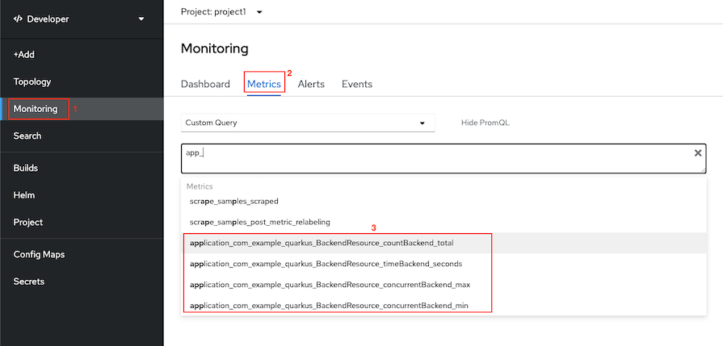
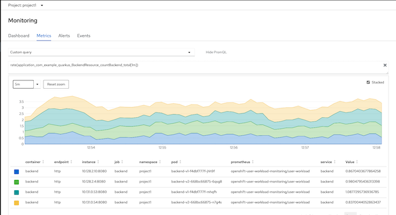
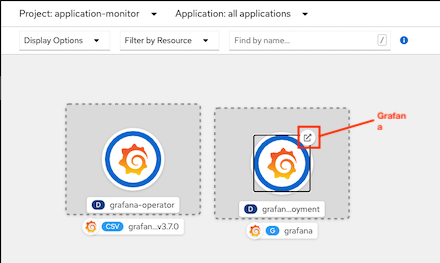
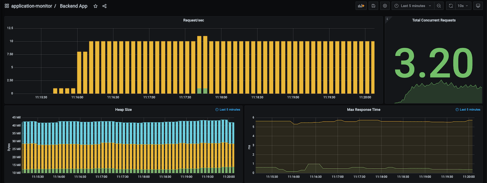
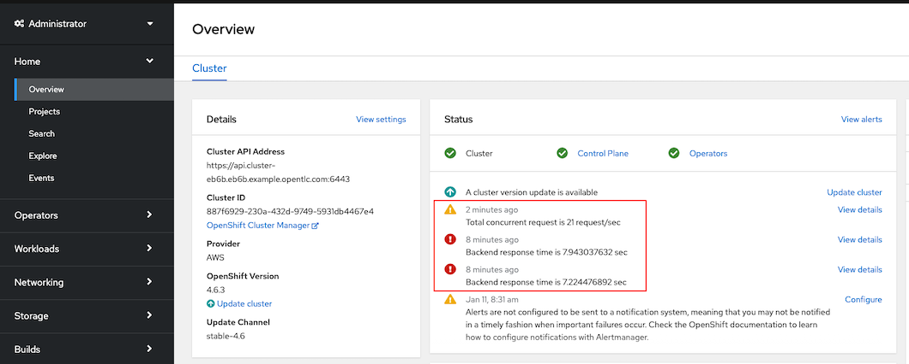

# User Workload Metrics
<!-- TOC -->

- [User Workload Metrics](#user-workload-metrics)
  - [Prerequisites](#prerequisites)
  - [Service Monitoring](#service-monitoring)
  - [Custom Grafana Dashboard](#custom-grafana-dashboard)
  - [Custom Alert](#custom-alert)

<!-- /TOC -->
## Prerequisites
- Setup [User Workload Monitoring](manifests/user-workload-monitoring.yaml)
  
  ```bash
  oc apply -f  manifests/user-workload-monitoring.yaml
  ```

  Remark: You also need to setup and configure [cluster monitoring](infrastructure-monitoring-alerts.md) or use following [simple configuration](manifests/cluster-monitoring-config.yaml). You may need to change *storageClassName* based on your cluster configuration

  ```bash
  oc apply -f  manifests/cluster-monitoring-config.yaml
  ```
- Verify monitoring stack
  
  ```bash
  oc  get pod -n openshift-user-workload-monitoring
  ```

  Sample output
  
  ```bash
  NAME                                   READY   STATUS    RESTARTS   AGE
  prometheus-operator-5fc7d894dc-9nlhc   2/2     Running   0          9m3s
  prometheus-user-workload-0             4/4     Running   1          5m45s
  prometheus-user-workload-1             4/4     Running   1          6m1s
  thanos-ruler-user-workload-0           3/3     Running   5          8m55s
  thanos-ruler-user-workload-1           3/3     Running   0          11s
  ```
  
## Service Monitoring
- Deploy application with custom metrics
  - Backend application provides metrics by /metrics and /metrics/applications
  
    ```bash
    oc apply -f manifests/frontend.yaml -n project1
    oc apply -f manifests/backend.yaml -n project1
    oc set env deployment/frontend-v1 BACKEND_URL=http://backend:8080/ -n project1
    oc set env deployment/frontend-v2 BACKEND_URL=http://backend:8080/ -n project1
    ```

  - Test backend's  metrics
  
    ```bash
    oc exec -n project1 $(oc get pods -n project1 | grep backend | head -n 1 | awk '{print $1}') \
    -- curl -Ls  http://localhost:8080/metrics
    ```
    Sample output
  
    ```bash
    # TYPE vendor_memory_committedNonHeap_bytes gauge
    vendor_memory_committedNonHeap_bytes 3.1780976E7
    # HELP vendor_memory_maxNonHeap_bytes Displays the maximum amount of used non-heap memory in bytes.
    # TYPE vendor_memory_maxNonHeap_bytes gauge
    vendor_memory_maxNonHeap_bytes -1.0
    # HELP vendor_memory_usedNonHeap_bytes Displays the amount of used non-heap memory in bytes.
    # TYPE vendor_memory_usedNonHeap_bytes gauge
    vendor_memory_usedNonHeap_bytes 3.1780976E7
    ```

  - Test backend application level's metrics
  
    ```bash
    oc exec -n project1 $(oc get pods -n project1 | grep backend | head -n 1 | awk '{print $1}') \
    -- curl -Ls http://localhost:8080/metrics/application
    ```
    Sample output
  
    ```bash
    # HELP application_com_example_quarkus_BackendResource_timeBackend_seconds Times how long it takes to invoke the backend method
    # TYPE application_com_example_quarkus_BackendResource_timeBackend_seconds summary
    application_com_example_quarkus_BackendResource_timeBackend_seconds_count 889.0
    application_com_example_quarkus_BackendResource_timeBackend_seconds{quantile="0.5"} 0.213724005
    application_com_example_quarkus_BackendResource_timeBackend_seconds{quantile="0.75"} 0.213724005
    application_com_example_quarkus_BackendResource_timeBackend_seconds{quantile="0.95"} 0.213724005
    application_com_example_quarkus_BackendResource_timeBackend_seconds{quantile="0.98"} 0.213724005
    application_com_example_quarkus_BackendResource_timeBackend_seconds{quantile="0.99"} 0.213724005
    application_com_example_quarkus_BackendResource_timeBackend_seconds{quantile="0.999"} 0.213724005
    ```

    
- Create [Service Monitoring](manifests/backend-monitor.yaml) to monitor backend service
    
    ```bash
    oc apply -f manifests/backend-monitor.yaml -n project1
    ```
    
    Remark: Role **monitor-edit** is required for create **ServiceMonitor** and **PodMonitor** resources. Following example is granting role montior-edit to user1 for project1

    ```bash
    oc adm policy add-role-to-user  monitoring-edit user1 -n project1
    ```
    
- Developer Console monitoring metrics  
  - Select application metrics

    

  - Application metrics 
    
    - Request counted

      

    - Concurrent requests
    
      

## Custom Grafana Dashboard
<!-- https://access.redhat.com/solutions/5335491 -->
Use Grafana Operator (Community Edition) to deploy Grafana and configure datasource to Thanos Querier
- Create project
  
  ```bash
  oc new-project application-monitor --display-name="Custom Grafana" --description="Custom Grafana"
  ```
  
- Install Grafana Operator to project application-monitor
  - Install Grafana Operator from OperatorHub

  

  - Install to application-monitor project
  
  
  
- Create [Grafana instance](manifests/grafana.yaml)
  
  ```bash
  oc create -f manifests/grafana.yaml -n application-monitor
  oc get pods -n application-monitor
  ```
  
  Sample Output
  
  ```bash
  NAME                                 READY   STATUS    RESTARTS   AGE
  grafana-deployment-cd4764497-jcwtx   1/1     Running   0          52s
  grafana-operator-7d585d8fb4-nks8s    1/1     Running   0          4m55s
  ```
  
- Add cluster role `cluster-monitoring-view` to Grafana ServiceAccount

  ```bash
  oc adm policy add-cluster-role-to-user cluster-monitoring-view \
  -z grafana-serviceaccount -n application-monitor
  ```

- Create [Grafana DataSource](manifests/grafana-datasource.yaml) with serviceaccount grafana-serviceaccount's token and connect to thanos-querier

  ```bash
  TOKEN=$(oc serviceaccounts get-token grafana-serviceaccount -n application-monitor)
  cat manifests/grafana-datasource.yaml|sed 's/Bearer .*/Bearer '"$TOKEN""'"'/'|oc apply -n application-monitor -f -
  ```  

- Create [Grafana Dashboard](manifests/grafana-dashboard.yaml)

  ```bash
  oc apply -f manifests/grafana-dashboard.yaml -n application-monitor 
  ```

- Login to Grafana Dashboard with following URL
  
  ```bash
  echo "Grafana URL => https://$(oc get route grafana-route -o jsonpath='{.spec.host}' -n application-monitor)"
  ```
  
  or use link provided by Developer Console

  

  Login with user `admin` and password `openshift`

  
  
- Generate workload
  - bash script to loop request to frontend application.
  
    ```bash
    FRONTEND_URL=https://$(oc get route frontend -n project1 -o jsonpath='{.spec.host}')
    while [ 1 ];
    do
      curl $FRONTEND_URL
      printf "\n"
      sleep .2
    done
    ```

  - k6 load test tool
  
    ```bash
    FRONTEND_SVC=$(oc get svc -n project1 | grep frontend | head -n 1 | awk '{print $1}')
     oc run load-test-frontend -n project1 \
    -i --image=loadimpact/k6  \
    --rm=true --restart=Never --  run -< manifests/load-test-k6.js \
    -e URL=http://frontend-v1:8080 \
    -e THREADS=10 \
    -e RAMPUP=30s \
    -e DURATION=5m \
    -e RAMEDOWN=30s
    ```
  Remark: You need to configure frontend app to connect to backend app

  ```bash
  oc set env deployment/frontend-v1 BACKEND_URL=http://backend:8080/ -n project1
  oc set env deployment/frontend-v2 BACKEND_URL=http://backend:8080/ -n project1
  ```
  
- Grafana Dashboard
  
  

## Custom Alert

- Check `PrometheusRule` [backend-app-alert](manifests/backend-custom-alert.yaml)
 
  ```yaml
  apiVersion: monitoring.coreos.com/v1
  kind: PrometheusRule
  metadata:
    name: backend-app-alert
    namespace: project1
    labels:
      openshift.io/prometheus-rule-evaluation-scope: leaf-prometheus
  spec:
    groups:
    - name: backend-app
      rules:
      - alert: ConcurrentBackend
        expr: sum(application_com_example_quarkus_BackendResource_concurrentBackend_current)>15
        # wait just 1 minute for demo purpose
        for: 1m
        labels:
          severity: 'warning'
        annotations:
          message: 'Total concurrent request is {{ $value }} request/sec'
      - alert: HighLatency
        expr: application_com_example_quarkus_BackendResource_timeBackend_max_seconds>5
        labels:
          severity: 'critical'
        annotations:
          message: '{{ $labels.instance }} response time is {{ $value }} sec'
  ```

  [backend-app-alert](manifests/backend-custom-alert.yaml) is consists with 2 following alerts:
  
  - ConcurrentBackend
    severity warning when total concurrent reqeusts is greater than 15
  - HighLatency
    servierity critical when response time is greateer than 5 sec  


- Create [backend-app-alert](manifests/backend-custom-alert.yaml) 

  ```bash
  oc apply -f manifests/backend-custom-alert.yaml
  ```

  Remark: Role `monitoring-rules-view` is required for view `PrometheusRule` resource and role `monitoring-rules-edit` is required to  create, modify, and deleting `PrometheusRule` 
  
  Following example is granting role monitoring-rules-view and monitoring-rules-edit to user1 for project1

  ```bash
  oc adm policy add-role-to-user  monitoring-rules-view user1 -n project1
  oc adm policy add-role-to-user  monitoring-rules-edit user1 -n project1

  ``` 
  
- For simplified our test, set backend app to 2 pod
  
  ```bash
  oc delete deployment backend-v2 -n project1
  oc scale deployment backend-v1 --replicas=2 -n project1
  ```
  
- Test `ConcurrentBackend` alert with 25 concurrent requests

  ```bash
  FRONTEND_URL=https://$(oc get route frontend -n project1 -o jsonpath='{.spec.host}')
  siege -c 25 $FRONTEND_URL
  ```
  If you don't have siege, run k6 as pod on OpenShift
  - 25 threads
  - Duration 2 minutes
  - Ramp up 30 sec
  - Ramp down 30 sec
  
  ```bash
  FRONTEND_URL=https://$(oc get route frontend -n project1 -o jsonpath='{.spec.host}')
  oc run load-test -n project1 -i \
  --image=loadimpact/k6 --rm=true --restart=Never \
  --  run -  < manifests/load-test-k6.js \
  -e URL=$FRONTEND_URL -e THREADS=25 -e DURATION=2m -e RAMPUP=30s -e RAMPDOWN=30s
  ```

  Check for alert in Developer Console by select Menu `Monitoring` then select `Alerts`

  

- Test `HighLatency` alert
  - Set backend with 6 sec response tim
    - By CLI
      ```bash
      oc set env deployment/backend-v1 APP_BACKEND=https://httpbin.org/delay/6 -n project1
      ```
    - By Developer Console
      - Select `Topology` then select backend-v1 and select dropdown menu `Edit Deployment`
        
        
        
      - Select `Environment` and set APP_BACKEND to https://httpbin.org/delay/6

        
  - Request to frontend app
    
    ```bash
    curl $FRONTEND_URL
    ```
  - Check for alert in Developer Console 
    
    

  - Console overview status

    