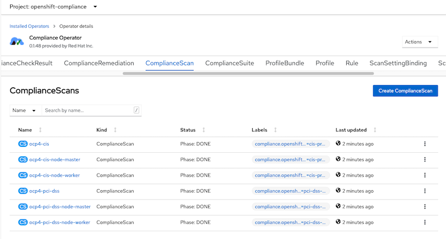
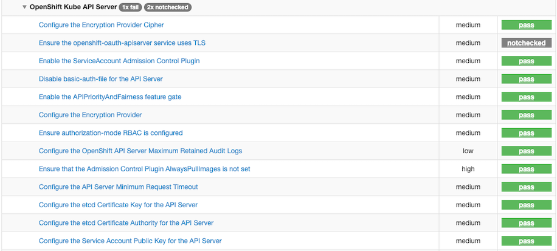

# OpenShift Compliance with Compliance Operator

- [OpenShift Compliance with Compliance Operator](#openshift-compliance-with-compliance-operator)
  - [Prerequisites](#prerequisites)
  - [Compliance Operator](#compliance-operator)
  - [CIS Profile](#cis-profile)
  - [Openscap Report](#openscap-report)

## Prerequisites
- OpenShift 4.6 or 4.7
- Cluster-admin user access


## Compliance Operator

- Install Compliance Operator from OperatorHub
- **[Optional]** Verify Compliance Operator
  - Check compliance profile
    
    ```bash
    oc get profiles.compliance -n openshift-compliance
    ```

    Output example

    ```bash
    NAME                 AGE
    ocp4-cis             10m
    ocp4-cis-node        10m
    ocp4-e8              10m
    ocp4-moderate        10m
    ocp4-moderate-node   10m
    rhcos4-e8            10m
    rhcos4-moderate      10m
    ```

  - Check detail of profile
    
    ```bash
    oc get -o yaml profiles.compliance ocp4-cis  -n openshift-compliance
    ```

   Output example

   ```yaml
   ...
   rules:
    - ocp4-accounts-restrict-service-account-tokens
    - ocp4-accounts-unique-service-account
    - ocp4-api-server-admission-control-plugin-alwaysadmit
    - ocp4-api-server-admission-control-plugin-alwayspullimages
    - ocp4-api-server-admission-control-plugin-namespacelifecycle
    - ocp4-api-server-admission-control-plugin-noderestriction
   ...
   ```
  - Check details of rule
    
    ```bash
    oc get -o yaml rules.compliance ocp4-accounts-unique-service-account  -n openshift-compliance
    ```

- Check for default ScanSetting
  
  - List all ScanSetting
    
    ```bash
    oc get scansettings -n openshift-compliance
    ```

    Result

    ```bash
    NAME                 AGE
    default              35m
    default-auto-apply   35m
    ```

  - Check for *default* ScanSetting
  
    ```bash
    oc describe scansettings default -n openshift-compliance 
    ```

    Output example, scheduled at 1AM everyday and apply to both master and worker node and use block storage (RWO) for stored result

    ```bash
    Raw Result Storage:
      Pv Access Modes:
        ReadWriteOnce
      Rotation:  3
      Size:      1Gi
    Roles:
      worker
      master
    Scan Tolerations:
      Effect:    NoSchedule
      Key:       node-role.kubernetes.io/master
      Operator:  Exists
      Schedule:    0 1 * * *
      Events:      <none>
    ```
## CIS Profile

- To start scan, create ScanSettingBinding. Scan will be started immediately after save
  - Use Admin Console to create ScanSettingBinding, default is *rhcos4-moderate* and use default *ScanSetting*

    

  - Add *opc4-cis* and *ocp4-cis-node* profiles to [ScanSettingBinding](manifests/cis-profile.yaml)
  
    ```yaml
    apiVersion: compliance.openshift.io/v1alpha1
    profiles:
      - apiGroup: compliance.openshift.io/v1alpha1
        name: ocp4-cis-node
        kind: Profile
      - apiGroup: compliance.openshift.io/v1alpha1
        name: ocp4-cis
        kind: Profile 
    settingsRef:
      apiGroup: compliance.openshift.io/v1alpha1
      name: default
      kind: ScanSetting
    kind: ScanSettingBinding
    metadata:
      name: cis-profile
      namespace: openshift-compliance
    ```

    or use CLI

    ```bash
    oc apply -f manifests/cis-profile.yaml
    oc describe scansettingbinding/cis-profile -n openshift-compliance
    ```

    Check for status
    
    ```bash
    Status:
      Conditions:
        Last Transition Time:  2021-09-15T04:05:27Z
        Message:               The scan setting binding was successfully processed
        Reason:                Processed
        Status:                True
        Type:                  Ready
      Output Ref:
        API Group:  compliance.openshift.io
        Kind:       ComplianceSuite
        Name:       cis-profile
    Events:
      Type    Reason        Age   From                    Message
      ----    ------        ----  ----                    -------
      Normal  SuiteCreated  2s    scansettingbindingctrl  ComplianceSuite openshift-compliance/cis-profile created
    ```
  
  - Check ComplianceScan tab
    
    

  - or use CLI
    
    ```bash
    watch -d oc get compliancescan -n openshift-compliance
    ```
    
    Output

    ```bash
    NAME                   PHASE         RESULT
    ocp4-cis               AGGREGATING   NOT-AVAILABLE
    ocp4-cis-node-master   RUNNING       NOT-AVAILABLE
    ocp4-cis-node-worker   AGGREGATING   NOT-AVAILABLE
    ```

    When compliance scan is completed

    ```bash
    NAME                   PHASE   RESULT
    ocp4-cis               DONE    NON-COMPLIANT
    ocp4-cis-node-master   DONE    NON-COMPLIANT
    ocp4-cis-node-worker   DONE    NON-COMPLIANT
    ```

- Check result
  - Count for FAIL 
  
    ```bash
    oc get compliancecheckresult -n openshift-compliance | grep FAIL | wc -l
    ```

    Output

    ```bash
    29
    ```

  - Script for summary result [bin/check-compliance-result.sh](bin/check-compliance-result.sh) 
    
    ```bash
    ================== RESULT ==================
    TYPE          	NUMBER
    PASS          	201
    FAIL          	29
    MANUAL        	26
    INFO          	0
    NOT_APPLICABLE	0
    INCONSISTENT  	0

    ================ SEVERITY =================
    high          	9
    low           	8
    medium        	280
    ```

  - Check for result description for *ocp4-cis-api-server-encryption-provider-config*
    
    ```bash
    oc describe compliancecheckresult/ocp4-cis-api-server-encryption-provider-config -n openshift-compliance
    ```
    
    Output
    
    ```bash
    ...
    Description:  Configure the Encryption Provider
    etcd is a highly available key-value store used by OpenShift deployments
    for persistent storage of all REST API objects. These objects are
    sensitive in nature and should be encrypted at rest to avoid any
    disclosures.
    Id:            xccdf_org.ssgproject.content_rule_api_server_encryption_provider_config
    Instructions:  Run the following command:
    $ oc get apiserver cluster -ojson | jq -r '.spec.encryption.type'
    The output should return aescdc as the encryption type.
    ...
    Severity:                  medium
    Status:                    FAILED
    Events:                    <none> 
    ```

- Fix failed policies with *ComplianceRemediation*
  - List *ComplianceRemediation*
  
    ```bash
    oc get ComplianceRemediation -n openshift-compliance
    ```

    Output

    ```bash
    NAME                                             STATE
    ocp4-cis-api-server-encryption-provider-cipher   NotApplied
    ocp4-cis-api-server-encryption-provider-config   NotApplied
    ```

  - Fix failed *ocp4-cis-api-server-encryption-provider-config* and *ocp4-cis-api-server-encryption-provider-cipher* policy with *ComplianceRemidiation*
  
    ```bash
    oc patch -n openshift-compliance complianceremediation \
    ocp4-cis-api-server-encryption-provider-config -p '{"spec":{"apply":true}}' --type='merge'
    oc patch -n openshift-compliance complianceremediation \
    ocp4-cis-api-server-encryption-provider-cipher -p '{"spec":{"apply":true}}' --type='merge'
    ```

    Check result
    
    ```bash
    oc get ComplianceRemediation/ocp4-cis-api-server-encryption-provider-config -n openshift-compliance
    ```

    Output

    ```bash
    NAME                                             STATE
    ocp4-cis-api-server-encryption-provider-cipher   Applied
    ocp4-cis-api-server-encryption-provider-config   Applied
    ```
  
- Re-run scan
  -  Annotate *ComplianceScans* to rescan or use [script](bin/rerun-compliance-scan.sh)
    
    ```bash
    for scan in $(oc get compliancescans -n openshift-compliance -o custom-columns=NAME:.metadata.name --no-headers)
    do
    oc annotate compliancescans $scan compliance.openshift.io/rescan= -n openshift-compliance
    done
    watch -d oc get compliancescans -n openshift-compliance
    ```

    Result

    ```bash
    ocp4-cis               LAUNCHING   NOT-AVAILABLE
    ocp4-cis-node-master   PENDING     NOT-AVAILABLE
    ocp4-cis-node-worker   PENDING     NOT-AVAILABLE
    ```

  - Recheck policy *ocp4-cis-api-server-encryption-provider-config*
    
    ```bash
    oc describe compliancecheckresult/ocp4-cis-api-server-encryption-provider-config -n openshift-compliance | grep -A3 Severity
    ```
    
    Output
    
    ```bash
    Severity:                  medium
    Status:                    PASS
    Events:                    <none>
    ```

- Change *ScanSettingBinding* cis-and-moderate-profile to use ScanSetting *default-auto-apply*
  
  ```bash
  oc patch -n openshift-compliance ScanSettingBinding cis-profile -p '{"settingsRef":{"name":"default-auto-apply"}}' --type='merge'
  ```

  Output

  ```bash
  scansettingbinding.compliance.openshift.io/cis-profile patched
  ```

- [Recheck result](bin/check-compliance-result.sh)
  
  ```bash
  ================== RESULT ==================
  TYPE          	NUMBER
  PASS          	203
  FAIL          	27
  MANUAL        	26
  INFO          	0
  NOT_APPLICABLE	0
  INCONSISTENT  	0

  ================ SEVERITY =================
  high          	9
  low           	8
  medium        	280
  ```

 ## Openscap Report

 
 - Generate HTML reports for latest scan results by using oscap tools. Container image with oscap tools already build with this [Dockerfile](manifests/Dockerfile.oscap)
   
  - Create pods to mount to reports PVC
   
    ```bash
    oc create -f manifests/cis-report.yaml -n openshift-compliance
    watch oc get pods -l app=report-generator -n openshift-compliance
    ```

    Output

    ```bash
    NAME                READY   STATUS    RESTARTS   AGE
    cis-master-report   1/1     Running   0          54s
    cis-report          1/1     Running   0          55s
    cis-worker-report   1/1     Running   0          55s
    ```

    

  - Generate reports with *oscap*
  
    ```bash
    REPORTS_DIR=compliance-operator-reports
    mkdir -p $REPORTS_DIR
    reports=(cis-report cis-worker-report cis-master-report)
    for report in ${reports[@]}
    do
      DIR=$(oc exec -n openshift-compliance $report -- ls -1t /reports|grep -v "lost+found"|head -n 1)

      for file in $(oc exec -n openshift-compliance $report -- ls -1t /reports/$DIR)
      do
        echo "Generate report for $report from $file"
        oc exec -n openshift-compliance $report -- oscap xccdf generate report /reports/$DIR/$file > $REPORTS_DIR/$report-$file.html
      done
    done 
    oc delete pods -l app=report-generator -n openshift-compliance
    ```
   
    Sample output

    ```bash
      Generate report for cis-report from ocp4-cis-api-checks-pod.xml.bzip2
      Generate report for cis-worker-report from openscap-pod-f73cef8b1e6a98fa8233b84163f62300c60df10e.xml.bzip2
      Generate report for cis-worker-report from openscap-pod-ac5e7838c12d9bea905d474069522b5b502ad724.xml.bzip2
      Generate report for cis-master-report from openscap-pod-47877a9e79536f85e552662526e0cd247278bf47.xml.bzip2
      Generate report for cis-master-report from openscap-pod-3c5d5e72bf73ebbdbc4ff5cf27f6c3443534e9d6.xml.bzip2
      Generate report for cis-master-report from openscap-pod-cd506d793bc03ad62909572b95df1d2d94d13a3e.xml.bzip2
    ```
 
 - Sample reports [cis](compliance-operator-reports/cis-report-ocp4-cis-api-checks.pdf) a
  
   

   HTML version here 
   - [CIS](compliance-operator-reports/cis-report-ocp4-cis-api-checks.html)
   - [CIS Master Node](compliance-operator-reports//cis-master-report.html)
   - [CIS Worker Node](compliance-operator-reports/cis-worker-report.html)

