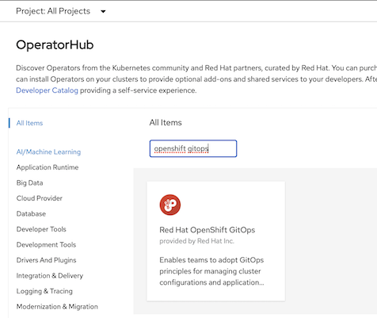
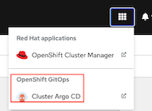
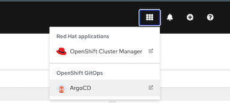
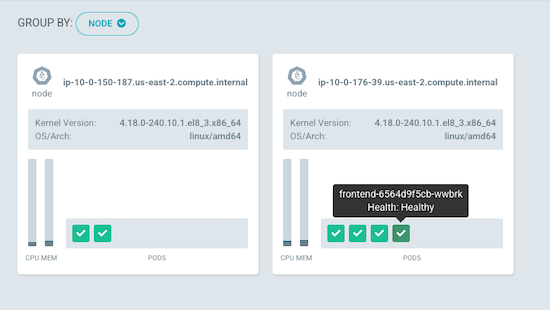

# OpenShift GitOps
- [OpenShift GitOps](#openshift-gitops)
  - [GitOps Operator](#gitops-operator)
    - [ArgoCD CLI](#argocd-cli)
    - [Add Cluster](#add-cluster)
  - [ArcoCD Applications](#arcocd-applications)
    - [Frontend/Backend App](#frontendbackend-app)
    - [Todo App](#todo-app)
  - [ArgoCD Web Console](#argocd-web-console)
  
## GitOps Operator

- Install OpenShift GitOps Operator
  
  

- Wait for few minutes. Check ArgoCD's pods in openshift-gitops namespace
  
  ```bash
  oc get pods -n openshift-gitops
  ```
  
  Output
  
  ```bash
  NAME                                                        READY   STATUS    RESTARTS   AGE
  cluster-5b574cff45-szpsl                                    1/1     Running   0          36s
  kam-7f65f49f56-2bd7g                                        1/1     Running   0          35s
  openshift-gitops-application-controller-0                   1/1     Running   0          35s
  openshift-gitops-applicationset-controller-769bc45f-qbhs6   1/1     Running   0          35s
  openshift-gitops-redis-7765dd9fc9-gbc42                     1/1     Running   0          35s
  openshift-gitops-repo-server-7c46884cf6-jjrn8               1/1     Running   0          35s
  openshift-gitops-server-7975f7b985-56tn7                    1/1     Running   0          35s
  ```

- Access ArgoCD Console. 

  - Select Cluster Argo CD from top menu bar
    
    

  - By CLI

    ```bash
    ARGOCD=$(oc get route/openshift-gitops-server -n openshift-gitops -o jsonpath='{.spec.host}')
    echo https://$ARGOCD
    ```
  
  *Notice that ArgoCD route is passtrough.*

  - Extract password from secret
    
    ```bash
    PASSWORD=$(oc extract secret/openshift-gitops-cluster -n openshift-gitops --to=-) 2>/dev/null
    echo $PASSWORD
    ```

- Install argocd cli. For OSX use brew
  
  ```bash
  brew install argocd
  ```

### ArgoCD CLI

- login to argocd
  ```bash
  argocd login $ARGOCD  --insecure \
  --username admin \
  --password $PASSWORD
  ```
  Output
  ```bash
  'admin:login' logged in successfully
  Context 'openshift-gitops-server-openshift-gitops.apps.cluster-0e2b.0e2b.sandbox563.opentlc.com' updated
  ```
- Use oc or kubectl CLI to login to target cluster and rename context
  ```bash
  oc config rename-context $(oc config current-context) dev-cluster
  ```
  Output
  ```bash
  Context "default/api-cluster-0e2b-0e2b-sandbox563-opentlc-com:6443/opentlc-mgr" renamed to "dev-cluster".
  ```

### Add Cluster

- Use argocd CLI to add current cluster to be managed by ArgoCD
  
  ```bash
  argocd cluster add dev-cluster
  ```
  
  Output
  
  ```bash
  INFO[0001] ServiceAccount "argocd-manager" already exists in namespace "kube-system"
  INFO[0001] ClusterRole "argocd-manager-role" updated
  INFO[0002] ClusterRoleBinding "argocd-manager-role-binding" updated
  Cluster 'https://api.cluster-0e2b.0e2b.sandbox563.opentlc.com:6443' added
  ```

## ArcoCD Applications

### Frontend/Backend App

- Create application [demo-dev-cluster](manifests/gitops/applications/demo-dev-cluster.yaml)
  
  ```bash
  oc apply -f manifests/gitops/applications/demo-dev-cluster.yaml
  ```

  Output
  
  ```bash
  application.argoproj.io/demo-dev-cluster created
  ```

- Check application demo-dev-cluster status
  
  ```bash
  oc get application -n openshift-gitops
  ```

  Output
  
  ```bash
  NAME               SYNC STATUS   HEALTH STATUS
  demo-dev-cluster   Synced        Healthy
  ```

- demo-dev-cluster use kustomize and configured to manifests/apps-kustomize/overlyas/dev

  ```bash
  manifests/apps-kustomize
  ├── base
  │   ├── backend-service.yaml
  │   ├── backend.yaml
  │   ├── demo-rolebinding.yaml
  │   ├── frontend-service.yaml
  │   ├── frontend.yaml
  │   ├── kustomization.yaml
  │   ├── namespace.yaml
  │   └── route.yaml
  └── overlays
      ├── dev
      │   ├── backend.yaml
      │   ├── frontend.yaml
      │   └── kustomization.yaml
      └── prod
          ├── backend.yaml
          ├── frontend.yaml
          └── kustomization.yaml
  ```

### Todo App

Order of operation sync by ArgoCD can be managed by Phase and Wave 
  * Phase: PreSync, Sync and PostSync
  * Wave: lower number first

todo-dev-cluster is ordered by todo-db, todo app and service montioring.

- Create application [todo-dev-cluster](manifests/gitops/applications/todo-dev-cluster.yaml)
  
  ```bash
  oc apply -f manifests/gitops/applications/todo-dev-cluster.yaml
  ```

- Check for Hook and Wave in 

  - Todo Database [todo-db.yaml](manifests/todo-kustomize/base/todo-db.yaml)
    - Secret sync-wave -1
    - PVC and Deployment sync-wave 1

    ```yaml
      annotations:
        argocd.argoproj.io/hook: PreSync
        argocd.argoproj.io/sync-wave: "1"
    ```

  -  Todo App [todo.yaml](manifests/todo-kustomize/base/todo.yaml)

    ```yaml
      annotations:
        argocd.argoproj.io/hook: Sync
        argocd.argoproj.io/sync-wave: "1"
    ```

## ArgoCD Web Console

- Walkthrough ArgoCD console

  - Open ArgoCD URL

    

  - Application status
    
    Overall
    
    

    Reference to git commit

    

  - Application topology
    
    

  - Node topology

    

  - Pod's log

    
