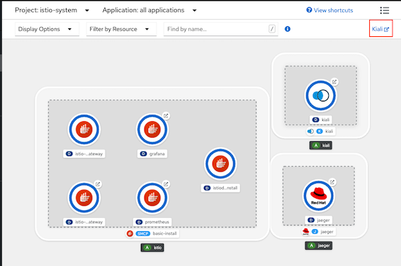
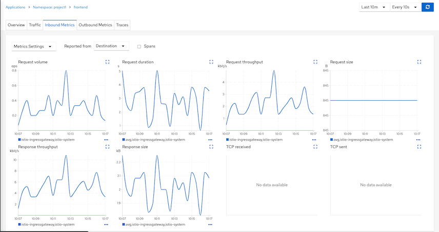
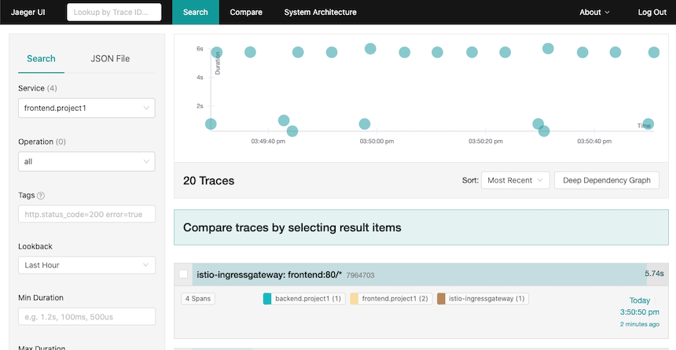
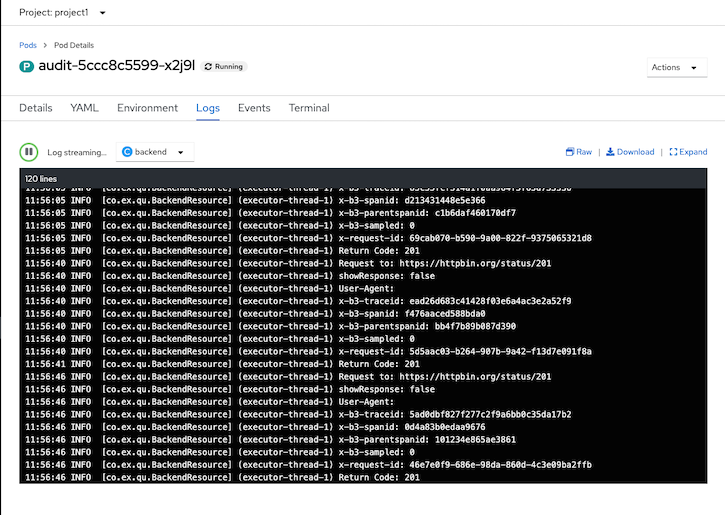
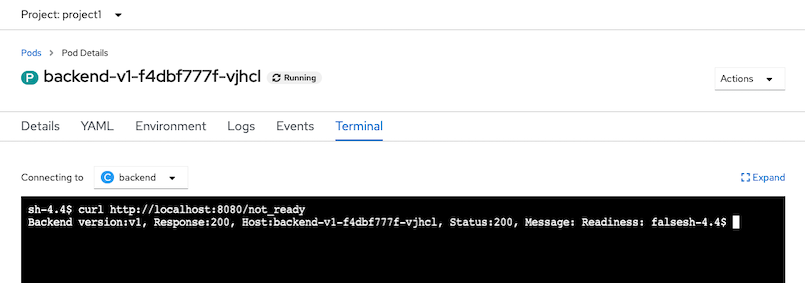
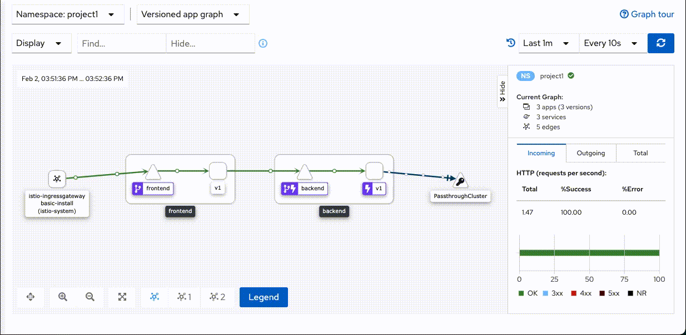

# OpenShift Service Mesh
<!-- TOC -->

- [OpenShift Service Mesh](#openshift-service-mesh)
    - [Overview](#overview)
    - [Setup Control Plane and sidecar](#setup-control-plane-and-sidecar)
    - [Create Istio Gateway](#create-istio-gateway)
    - [Weight-Routing with Istio Virtual Service](#weight-routing-with-istio-virtual-service)
    - [Routing by condition based on URI](#routing-by-condition-based-on-uri)
    - [A/B with Istio Virtual Service](#ab-with-istio-virtual-service)
    - [Traffic Analysis](#traffic-analysis)
    - [Distributed Tracing](#distributed-tracing)
    - [Traffic Mirroring Dark Launch](#traffic-mirroring-dark-launch)
    - [Envoy Access Log](#envoy-access-log)
    - [Circuit Breaker](#circuit-breaker)
    - [Secure with mTLS](#secure-with-mtls)

<!-- /TOC -->

## Overview

Sample application

```mermaid
graph LR;
  client-->router;
  subgraph openshift-ingress;
  router;
  end;
  subgraph control-plane;
  istio-ingress;
  end;
  router-->istio-ingress;
  subgraph data-plane;
  istio-ingress-->frontend;
  frontend-->backend;
  end;
  subgraph "external system";
  httpbin.org;
  end;
  backend-->httpbin.org;
```

## Setup Control Plane and sidecar

- Install following Operators from OperatorHub
  - ElasticSearch
  - Jaeger
  - Kiali
  - OpenShift Service Mesh
- Create control plane by create ServiceMeshControlPlane CRD
  
  ```bash
  oc new-project istio-system
  oc create -f manifests/smcp.yaml -n istio-system
  ```
  
- Check for control plane([get-smcp-status.sh](bin/get-smcp-status.sh))

  ```bash
  bin/get-smcp-status.sh istio-system
  ```
  
- Join project1 into control plane
  - Review [ServiceMeshMemberRoll CRD](manifests/smcp.yaml)
  
    ```yaml
    apiVersion: maistra.io/v1
    kind: ServiceMeshMemberRoll
    metadata:
      name: default
    spec:
      members:
      - project1
    ```
  - Create data plane project

    ```bash
    oc new-project project1 
    ```  
  - Apply ServiceMeshMemberRoll
    
    ```bash
    oc create -f manifests/smmr.yaml -n istio-system
    ```
  - Check for ServiceMeshMemberRoll status

    ```bash
    oc describe smmr/default -n istio-system | grep -A2 Spec:
    ```
- Deploy sidecar to frontend app in project1
  
  ```bash
  oc apply -f manifests/frontend.yaml -n project1
  oc patch deployment/frontend-v1 -p '{"spec":{"template":{"metadata":{"annotations":{"sidecar.istio.io/inject":"true"}}}}}' -n project1
  oc patch deployment/frontend-v2 -p '{"spec":{"template":{"metadata":{"annotations":{"sidecar.istio.io/inject":"true"}}}}}' -n project1
  ```
  
  
  
  
- Check for sidecar in frontend-v1 and frontend-v2 pods
  
  ```bash
  oc get pods -n project1
  #Sample output
  NAME                           READY   STATUS        RESTARTS   AGE
  frontend-v1-577b98f48c-6j5zg   2/2     Running       0          15s
  frontend-v1-c5d4648f9-7jfk2    1/1     Terminating   0          13m
  frontend-v2-5cd968bc59-cwsd8   2/2     Running       0          14s
  frontend-v2-5d4dbdbc9-k6787    1/1     Terminating   0          13m
  ```

  


- Check [frontend service](manifests/frontend-service.yaml) which set slector to both v1 and v2
  
  ```yaml
  selector:
    app: frontend
  ```

- Create [frontend service](manifests/frontend-service.yaml)
  
  ```bash
  oc create -f manifests/frontend-service.yaml -n project1
  ```

## Create Istio Gateway
- Create Gateway for frontend app
  - Check for cluster's sub-domain
    ```bash
    SUBDOMAIN=$(oc whoami --show-console|awk -F'apps.' '{print $2}')
    echo $SUBDOMAIN
    ```
  - Review [Gateway CRD](manifests/frontend-gateway.yaml), Replaced SUBDOMAIN with cluster's sub-domain
    ```yaml
    apiVersion: networking.istio.io/v1alpha3
    kind: Gateway
    metadata:
    name: frontend-gateway
    spec:
    selector:
        istio: ingressgateway # use istio default controller
    servers:
    - port:
        number: 80
        name: http2
        protocol: HTTP
        hosts:
        - '*.apps.SUBDOMAIN'
        
    ```
  - Replace SUBDOMAIN with your clsuter sub-domain and Create [gateway](manifests/frontend-gateway.yaml)
  
    ```bash
    oc apply -f manifests/frontend-gateway.yaml -n istio-system
    ```
    or use following bash command 

    ```bash
    SUBDOMAIN=$(oc whoami --show-console|awk -F'apps.' '{print $2}')
    cat manifests/frontend-gateway.yaml | sed 's/SUBDOMAIN/'$SUBDOMAIN'/'|oc apply -n istio-system -f -
    ```
    
- Create Destination Rule for frontend v1 and frontend v2
  - Review [Destination Rule CRD](manifests/frontend-destination-rule.yaml)
  
    ```yaml
    apiVersion: networking.istio.io/v1alpha3
    kind: DestinationRule
    metadata:
        name: frontend
    spec:
        host: frontend
        subsets:
        - name: v1
        labels:
            app: frontend
            version: v1
        trafficPolicy:
            loadBalancer:
            simple: ROUND_ROBIN
        - name: v2
        labels:
            app: frontend
            version: v2
        trafficPolicy:
            loadBalancer:
            simple: ROUND_ROBIN
    ```
  - Create destination rule
  
    ```bash
    oc apply -f manifests/frontend-destination-rule.yaml -n project1
    ```
    
- Create Virtual Service for frontend app
  - Review [Virtual Service CRD](manifests/frontend-virtual-service.yaml), Replace SUBDOMAIN with cluster's sub-domain.
  
    ```yaml
    apiVersion: networking.istio.io/v1alpha3
    kind: VirtualService
    metadata:
        name: frontend
    spec:
        hosts:
        - frontend.apps.SUBDOMAIN
        gateways:
        - istio-system/frontend-gateway
        http:
        - route:
        - destination:
            port:
                number: 8080
            host: frontend.project1.svc.cluster.local
    ```
    
  - Replace SUBDOMAIN with cluster subdomain and create [virtual service](manifests/frontend-virtual-service.yaml)
  
    ```bash
    oc apply -f manifests/frontend-virtual-service.yaml -n project1
    ```
    or use following bash command 

    ```bash
    SUBDOMAIN=$(oc whoami --show-console|awk -F'apps.' '{print $2}')
    cat manifests/frontend-virtual-service.yaml | sed 's/SUBDOMAIN/'$SUBDOMAIN'/'|oc apply -n project1 -f -
    ```
  - Check that route is automatically created
  
    ```bash
    oc get route -n istio-system | grep istio-system-frontend-gateway
    
    # Sample outout
    istio-system-frontend-gateway-fmlsp   frontend.apps.cluster-ba08.ba08.example.opentlc.com                                   istio-ingressgateway   http2com                                   istio-ingressgateway   http2                        None
    ```
<!-- - Create Route (configured with Istio Gateway) for frontend app
  - Review [Route](manifests/frontend-route-istio.yaml), Replace SUBDOMAIN with cluster's subdomain
    ```yaml
    apiVersion: v1
    kind: Route
    metadata:
        name: frontend
    spec:
        host: frontend.apps.SUBDOMAIN
        port:
        targetPort: http2
        to:
        kind: Service
        name: istio-ingressgateway
        weight: 100
        wildcardPolicy: None

    ```
  - Replace SUBDOMAIN with cluster subdomain then create Route
  
    ```bash
    oc apply -f manifests/frontend-route-istio.yaml -n istio-system
    ```
    or use following bash command 

    ```bash
    SUBDOMAIN=$(oc whoami --show-console|awk -F'apps.' '{print $2}')
    cat manifests/frontend-route-istio.yaml | sed 's/SUBDOMAIN/'$SUBDOMAIN'/'|oc apply -n project1 -f -
    ``` -->

- Test with cURL
  
```bash
FRONTEND_ISTIO_ROUTE=$(oc get route -n istio-system|grep istio-system-frontend-gateway |awk '{print $2}')
curl http://$FRONTEND_ISTIO_ROUTE
```

## Weight-Routing with Istio Virtual Service
- Set weight routing between 2 services with virtual service
  - Check for [virtual service with weight routing](manifests/frontend-virtual-service-with-weight-routing.yaml), Replace SUBDOMAIN with cluster's subdomain.
  ```yaml
  apiVersion: networking.istio.io/v1alpha3
  kind: VirtualService
  metadata:
    name: frontend
  spec:
    hosts:
    - frontend.apps.SUBDOMAIN
    gateways:
    - istio-system/frontend-gateway
    http:
    - route:
      - destination:
          port:
            number: 8080
          host: frontend.project1.svc.cluster.local
          subset: v1
        weight: 100
      - destination:
          port:
            number: 8080
          host: frontend.project1.svc.cluster.local
          subset: v2
        weight: 0
  ```
  or use following bash command 

  ```bash
  SUBDOMAIN=$(oc whoami --show-console|awk -F'apps.' '{print $2}')
  cat manifests/frontend-virtual-service-with-weight-routing.yaml | sed 's/SUBDOMAIN/'$SUBDOMAIN'/'|oc apply -n project1 -f -
  ```
  
   - Apply [virtual service](manifests/frontend-virtual-service-with-weight-routing.yaml) for Blue/Green deployment with route all traffic to v1
    
   ```bash
   oc apply -f manifests/frontend-virtual-service-with-weight-routing.yaml -n project1
   ```
    
  - Test with cURL to verify that all requests are routed to v1
  - Blue/Green deployment by route all requests to v2
   
    ```bash
    oc patch virtualservice frontend --type='json' -p='[{"op":"replace","path":"/spec/http/0","value":{"route":[{"destination":{"host":"frontend.project1.svc.cluster.local","port":{"number":8080},"subset":"v1"},"weight":0},{"destination":{"host":"frontend.project1.svc.cluster.local","port":{"number":8080},"subset":"v2"},"weight":100}]}}]' -n project1
    ```

  - Test with cURL to verify that all requests are routed to v2
  - Canary deployment by weight requests between v1 and v2 with 70% and 30%
    
    ```bash
    oc patch virtualservice frontend --type='json' -p='[{"op":"replace","path":"/spec/http/0","value":{"route":[{"destination":{"host":"frontend.project1.svc.cluster.local","port":{"number":8080},"subset":"v1"},"weight":70},{"destination":{"host":"frontend.project1.svc.cluster.local","port":{"number":8080},"subset":"v2"},"weight":30}]}}]' -n project1
    ```
    
- Test canary deployment
  - Run 100 requests
  
    ```bash
    FRONTEND_ISTIO_ROUTE=$(oc get route -n istio-system|grep istio-system-frontend-gateway |awk '{print $2}')
    COUNT=0
    rm -f result.txt
    while [ $COUNT -lt 100 ];
    do
        OUTPUT=$(curl -s $FRONTEND_ISTIO_ROUTE/version)
        printf "%s\n" $OUTPUT >> result.txt
        printf "%s\n" $OUTPUT
        sleep .2
        COUNT=$(expr $COUNT + 1)
    done
    ```

  - Check result for comparing percentage of requests to v1 and v2
    
    ```bash
    printf "Version 1: %s\n" $(cat result.txt | grep "1.0.0" | wc -l)
    printf "Version 2: %s\n" $(cat result.txt | grep "2.0.0" | wc -l)
    rm -f result.txt
    ```
    
## Routing by condition based on URI
- Set conditional routing between 2 services with virtual service
  - Check for [virtual service by URI](manifests/frontend-virtual-service-with-uri.yaml), Replace SUBDOMAIN with cluster's subdomain. Condition with regular expression
      - Route to v1 if request URI start with "/ver" and end with "1"
    ```yaml
    apiVersion: networking.istio.io/v1alpha3
    kind: VirtualService
    metadata:
    name: frontend
    spec:
    hosts:
    - frontend.apps.SUBDOMAIN
    gateways:
    - istio-system/frontend-gateway
    http:
    - match:
        - uri:
            regex: /ver(.*)1
        rewrite:
        # Rewrite URI back to / because frontend app not have /ver(*)1
        uri: "/"
        route:
        - destination:
            host: frontend
            port:
            number: 8080
            subset: v1
    - route:
        - destination:
            host: frontend
            port:
            number: 8080
            subset: v2
    ```
- Apply virtual service
  
  ```bash
  oc apply -f manifests/frontend-virtual-service-with-uri.yaml -n project1
  ```
  
  or use following bash command 

  ```bash
  SUBDOMAIN=$(oc whoami --show-console|awk -F'apps.' '{print $2}')
  cat manifests/frontend-virtual-service-with-uri.yaml | sed 's/SUBDOMAIN/'$SUBDOMAIN'/'|oc apply -n project1 -f -
  ```

- Test with URI /version1 and /ver1
  
  ```bash
  FRONTEND_ISTIO_ROUTE=$(oc get route -n istio-system|grep istio-system-frontend-gateway |awk '{print $2}')
  curl $FRONTEND_ISTIO_ROUTE/version1
  curl $FRONTEND_ISTIO_ROUTE/vers1
  curl $FRONTEND_ISTIO_ROUTE/ver1
  ```
  
- Test with URI /
  
  ```bash
  FRONTEND_ISTIO_ROUTE=$(oc get route -n istio-system|grep istio-system-frontend-gateway |awk '{print $2}')
  curl $FRONTEND_ISTIO_ROUTE/
  ```
  
## A/B with Istio Virtual Service
- A/B testing by investigating User-Agent header with [Virtual Service](manifests/frontend-virtual-service-with-header.yaml), Replace SUBDOMAIN with cluster's sub-domain.
  - If HTTP header User-Agent contains text Firewall, request will be routed to frontend v2
   
  ```yaml
  apiVersion: networking.istio.io/v1alpha3
  kind: VirtualService
  metadata:
    name: frontend
  spec:
    hosts:
    - frontend.apps.SUBDOMAIN
    gateways:
    - istio-gateway/frontend-gateway
    http:
    - match:
      - headers:
          user-agent:
            regex: (.*)Firefox(.*)
      route:
      - destination:
          host: frontend
          port:
            number: 8080
          subset: v2
    - route:
      - destination:
          host: frontend
          port:
            number: 8080
          subset: v1
  ```
  
- Apply [Virtual Service](manifests/frontend-virtual-service-with-header.yaml)
  
  ```bash
  oc apply -f manifests/frontend-virtual-service-with-header.yaml -n project1
  ```
  
  or use following bash command 

  ```bash
  SUBDOMAIN=$(oc whoami --show-console|awk -F'apps.' '{print $2}')
  cat manifests/frontend-virtual-service-with-header.yaml | sed 's/SUBDOMAIN/'$SUBDOMAIN'/'|oc apply -n project1 -f -
  ```
  
- Test with cURL with HTTP header User-Agent contains Firefox
```bash
FRONTEND_ISTIO_ROUTE=$(oc get route -n istio-system|grep istio-system-frontend-gateway |awk '{print $2}')
  curl -H "User-Agent:Mozilla/5.0 (Macintosh; Intel Mac OS X 10.15; rv:78.0) Gecko/20100101 Firefox/78.0" $FRONTEND_ISTIO_ROUTE
```
## Traffic Analysis
- Deploy backend application
  
  ```bash
  oc apply -f manifests/backend.yaml -n project1
  oc apply -f manifests/backend-destination-rule.yaml -n project1
  oc apply -f manifests/backend-virtual-service-v1-v2-50-50.yaml -n project1
  oc get pods -n project1
  ```
  
- **Optional**: Draw connetion from frontend to backend in Developer Console

  ```bash
  oc annotate deployment frontend-v1 'app.openshift.io/connects-to=[{"apiVersion":"apps/v1","kind":"Deployment","name":"backend-v1"},{"apiVersion":"apps/v1","kind":"Deployment","name":"backend-v2"}]' -n project1
  oc annotate deployment frontend-v2 'app.openshift.io/connects-to=[{"apiVersion":"apps/v1","kind":"Deployment","name":"backend-v1"},{"apiVersion":"apps/v1","kind":"Deployment","name":"backend-v2"}]' -n project1
  ```
  
  

- Configure frontend to request to backend
  
  ```bash
  oc set env deployment/frontend-v1 BACKEND_URL=http://backend:8080/ -n project1
  oc set env deployment/frontend-v2 BACKEND_URL=http://backend:8080/ -n project1
  ```
  
- Check Kiali Console
- login to OpenShift Developer Console, select project istio-system and open Kiali console 

  
- Login to Kiali Console and select Graph
  -  Namespace: select checkbox "project1"
  -  Display: select checkbox "Requests percentage" and "Traffic animation"
- Run following command
  ```bash
  oc patch virtualservice frontend --type='json' -p='[{"op":"replace","path":"/spec/http/0","value":{"route":[{"destination":{"host":"frontend.project1.svc.cluster.local","port":{"number":8080},"subset":"v1"},"weight":70},{"destination":{"host":"frontend.project1.svc.cluster.local","port":{"number":8080},"subset":"v2"},"weight":30}]}}]' -n project1
  FRONTEND_ISTIO_ROUTE=$(oc get route -n istio-system|grep istio-system-frontend-gateway |awk '{print $2}')
  while [ 1 ];
  do
          OUTPUT=$(curl -s $FRONTEND_ISTIO_ROUTE)
          printf "%s\n" $OUTPUT
          sleep .2
  done
  ```
- Check Kiali Console

  

- Traffic analysis for frontend app. Select Application->frontend->inbound traffic and outbound traffic
  
  

## Distributed Tracing
- Distributed tracing with Jaeger. Select tab Tracing
  - Overall tracing for frontend app

    
    
  - Login to Jaeger by select "View in Tracing"
  
    
    
  - Drill down to tracing information

     
  
  - Show feature config on the fly in service --> frontend v2 --> action
  
## Traffic Mirroring (Dark Launch)
- Deploy audit app and mirror every requests that frontend call backend to audit app
  
  ```bash
  oc apply -f manifests/audit-app.yaml -n project1
  oc get pods -n project1
  ```

- Update [backend virtual service](manifests/backend-virtual-service-mirror.yaml) to mirror requests to audit app.
  
  ```bash
  oc apply -f manifests/backend-virtual-service-mirror.yaml -n project1
  ```
  
- Use cURL to call frontend and check audit's pod log by CLI (with another terminal) or Web Console
  - cURL frontend
  
  ```bash
  FRONTEND_ISTIO_ROUTE=$(oc get route -n istio-system|grep istio-system-frontend-gateway |awk '{print $2}')
  curl $FRONTEND_ISTIO_ROUTE
  ```

  - View audit log 
  
  ```bash
  oc logs -f $(oc get pods --no-headers | grep audit|head -n 1|awk '{print $1}') -c backend -n project1
  ```
  
  
  
  
## Envoy Access Log
- Envoy access log already enabled with [ServiceMeshControlPlane CRD](manifests/smcp.yaml)
  ```yaml
    proxy:
    accessLogging:
      envoyService:
        enabled: false
      file:
        encoding: TEXT
        name: /dev/stdout
  ```
- Check access log
  ```bash
  oc logs -f $(oc get pods -n project1 --no-headers|grep frontend|head -n 1|awk '{print $1}') -c istio-proxy -n project1
  ```
- Sample output
  ```log
  [2020-12-25T10:33:04.848Z] "GET / HTTP/1.1" 200 - "-" "-" 0 103 5750 5749 "-" "-" "0c3ce34a-f5a0-9340-b84f-3631cd8eb444" "backend:8080" "10.128.2.133:8080" outbound|8080|v2|backend.project1.svc.cluster.local 10.128.2.131:48300 172.30.116.252:8080 10.128.2.131:36992 - -
  [2020-12-25T10:33:04.846Z] "GET / HTTP/1.1" 200 - "-" "-" 0 184 5756 5755 "184.22.250.124,10.131.0.4" "curl/7.64.1" "0c3ce34a-f5a0-9340-b84f-3631cd8eb444" "frontend.apps.cluster-1138.1138.example.opentlc.com" "127.0.0.1:8080" inbound|8080|http|frontend-v1.project1.svc.cluster.local 127.0.0.1:56540 10.128.2.131:8080 10.131.0.4:0 outbound_.8080_.v1_.frontend.project1.svc.cluster.local default
  ```
## Circuit Breaker
- Configure our application to contains only frontend-v1 and backend-v1 and scale backend to 3 pods.

  ```bash
  oc apply -f manifests/frontend.yaml -n project1
  oc patch deployment/frontend-v1 -p '{"spec":{"template":{"metadata":{"annotations":{"sidecar.istio.io/inject":"true"}}}}}' -n project1
  oc apply -f manifests/backend.yaml -n project1
  oc delete deployment frontend-v2 -n project1
  oc delete deployment backend-v2 -n project1 
  oc delete svc frontend-v2 -n project1
  oc set env deployment/frontend-v1 BACKEND_URL=http://backend:8080/ -n project1
  oc annotate deployment frontend-v1 'app.openshift.io/connects-to=[{"apiVersion":"apps/v1","kind":"Deployment","name":"backend-v1"},{"apiVersion":"apps/v1","kind":"Deployment","name":"backend-v2"}]' -n project1
  oc delete route frontend -n project1
  oc scale deployment backend-v1 --replicas=3 -n project1
  oc apply -f manifests/backend-destination-rule-v1-only.yaml -n project1
  oc apply -f manifests/backend-virtual-service.yaml -n project1
  oc apply -f manifests/frontend-destination-rule-v1-only.yaml -n project1
  SUBDOMAIN=$(oc whoami --show-console|awk -F'apps.' '{print $2}')
  cat manifests/frontend-virtual-service.yaml | sed 's/SUBDOMAIN/'$SUBDOMAIN'/'|oc apply -n project1 -f -
  SUBDOMAIN=$(oc whoami --show-console|awk -F'apps.' '{print $2}')
  cat manifests/frontend-gateway.yaml | sed 's/SUBDOMAIN/'$SUBDOMAIN'/'|oc apply -n istio-system -f -
  oc get pods -n project1
  ```
- Test with cURL

  ```bash
  FRONTEND_ISTIO_ROUTE=$(oc get route -n istio-system|grep istio-system-frontend-gateway |awk '{print $2}')
  curl http://$FRONTEND_ISTIO_ROUTE

  # Sample output - Check for field Host that is backend pod that processed for this request
  Frontend version: 1.0.0 => [Backend: http://backend:8080/, Response: 200, Body: Backend version:v1, Response:200, Host:backend-v1-f4dbf777f-h7rwg, Status:200, Message: Hello, Quarkus]
  ```
- Loop 6 times. Result from backend will be round robin.
  - Create bash function

  ```bash
  function loop_frontend(){
    FRONTEND_ISTIO_ROUTE=$(oc get route -n istio-system|grep istio-system-frontend-gateway |awk '{print $2}')
    COUNT=0
    MAX=$1
    while [ $COUNT -lt $MAX ];
    do
      curl -s http://$FRONTEND_ISTIO_ROUTE | awk -F',' '{print $5 "=>" $6}'
      COUNT=$(expr $COUNT + 1 )
    done
  }
  ```

  - Run function with input paramter 6
  
  ```bash
  loop_frontend 6

  # Sample output
  Host:backend-v1-f4dbf777f-vjhcl=> Status:200
  Host:backend-v1-f4dbf777f-vjhcl=> Status:200
  Host:backend-v1-f4dbf777f-tgssd=> Status:200
  Host:backend-v1-f4dbf777f-h7rwg=> Status:200
  Host:backend-v1-f4dbf777f-vjhcl=> Status:200
  Host:backend-v1-f4dbf777f-tgssd=> Status:200
  ```
- By default, Envoy will automatically retry if it get response with code 503

  - Force one backend pod to return 503 

    - by command line.
    ```
    oc exec -n project1 -c backend $(oc get pod -n project1 | grep -m1 backend | cut -d " " -f1) -- curl -s http://localhost:8080/not_ready

    # Sample output
    Backend version:v1, Response:200, Host:backend-v1-f4dbf777f-h7rwg, Status:200, Message: Readiness: false
    ```
    
    - by Web Console
    
      
  
  - Verify response from that pod.
  
    ```bash
    oc exec -n project1 -c backend $(oc get pod -n project1 | grep -m1 backend | cut -d " " -f1) -- curl -sv http://localhost:8080/
    
    # Sample Output
    *   Trying ::1...
    * TCP_NODELAY set
    * Connected to localhost (::1) port 8080 (#0)
    > GET / HTTP/1.1
    > Host: localhost:8080
    > User-Agent: curl/7.61.1
    > Accept: */*
    >
    < HTTP/1.1 503 Service Unavailable
    < Content-Encoding: text/plain
    < Expires: Tue, 02 Feb 2021 08:18:22 GMT
    < Content-Length: 125
    < Content-Type: text/plain;charset=UTF-8
    <
    * Connection #0 to host localhost left intact
     Backend version:v1, Response:503, Host:backend-v1-f4dbf777f-h7rwg, Status:503, Message: Application readiness is set to false
    ```
    
  - Test with cURL again. You will get only status 200
    
    ```bash
    loop_frontend 10

    # Sample Output
    Host:backend-v1-f4dbf777f-tgssd=> Status:200
    Host:backend-v1-f4dbf777f-tgssd=> Status:200
    Host:backend-v1-f4dbf777f-tgssd=> Status:200
    Host:backend-v1-f4dbf777f-tgssd=> Status:200
    Host:backend-v1-f4dbf777f-tgssd=> Status:200
    Host:backend-v1-f4dbf777f-tgssd=> Status:200
    Host:backend-v1-f4dbf777f-tgssd=> Status:200
    Host:backend-v1-f4dbf777f-tgssd=> Status:200
    Host:backend-v1-f4dbf777f-tgssd=> Status:200
    Host:backend-v1-f4dbf777f-tgssd=> Status:200
    ```
  - Set backend pod to return 200
  
    ```bash
    oc exec -n project1 -c backend $(oc get pod -n project1 | grep -m1 backend | cut -d " " -f1) -- curl -s http://localhost:8080/ready
    ```  
- Test CB
- Update destination rule with circuit breaker
  
  ```bash
  oc apply -f manifests/backend-destination-rule-circuit-breaker.yaml -n project1
  ```
- Review Circuit Breaker configuration in [deatination rule](manifests/backend-destination-rule-circuit-breaker.yaml)
  -  If found error 1 times (consecutiveErrors)
  -  then eject that pod from pool for 15 mintues (baseEjectionTime)
  -  Maximum number of pod that can be ejected is 100% (maxEjectionPercent)
  -  Check this every 15 min (interval)
  
  ```yaml
  outlierDetection:
        baseEjectionTime: 15m
        consecutiveErrors: 1
        interval: 15m
        maxEjectionPercent: 100
  ```
  
- Set one backend pod to return 504 and verify that pod return 504
  
  ```bash
  oc exec -n project1 -c backend $(oc get pod -n project1 | grep -m1 backend | cut -d " " -f1) -- curl -sv http://localhost:8080/stop

  # Sample output
  *   Trying ::1...
  * TCP_NODELAY set
  * Connected to localhost (::1) port 8080 (#0)
  > GET /stop HTTP/1.1
  > Host: localhost:8080
  > User-Agent: curl/7.61.1
  > Accept: */*
  >
  < HTTP/1.1 200 OK
  < Content-Encoding: text/plain
  < Expires: Tue, 02 Feb 2021 08:37:59 GMT
  < Content-Length: 103
  < Content-Type: text/plain;charset=UTF-8
  <
  { [103 bytes data]
  * Connection #0 to host localhost left intact
  Backend version:v1, Response:200, Host:backend-v1-f4dbf777f-h7rwg, Status:200, Message: Liveness: false
  ```
- Verify that backend pod return 504

  ```bash
  oc exec -n project1 -c backend $(oc get pod -n project1 | grep -m1 backend | cut -d " " -f1) -- curl -sv http://localhost:8080/
    
  # Sample output
  *   Trying ::1...
  * TCP_NODELAY set
  * Connected to localhost (::1) port 8080 (#0)
  > GET / HTTP/1.1
  > Host: localhost:8080
  > User-Agent: curl/7.61.1
  > Accept: */*
  >
  < HTTP/1.1 504 Gateway Timeout
  < Content-Encoding: text/plain
  < Expires: Tue, 02 Feb 2021 08:42:33 GMT
  < Content-Length: 124
  < Content-Type: text/plain;charset=UTF-8
  <
  { [124 bytes data]
  * Connection #0 to host localhost left intact
  Backend version:v1, Response:504, Host:backend-v1-f4dbf777f-h7rwg, Status:504, Message: Application liveness is set to false
  ```  
- Test again with cURL. You will get 504 just one times.
  
  ```bash
  loop_frontend 15

  # Sample output
  Host:backend-v1-f4dbf777f-h7rwg=> Status:504
  Host:backend-v1-f4dbf777f-vjhcl=> Status:200
  Host:backend-v1-f4dbf777f-tgssd=> Status:200
  Host:backend-v1-f4dbf777f-tgssd=> Status:200
  Host:backend-v1-f4dbf777f-tgssd=> Status:200
  Host:backend-v1-f4dbf777f-tgssd=> Status:200
  Host:backend-v1-f4dbf777f-vjhcl=> Status:200
  Host:backend-v1-f4dbf777f-tgssd=> Status:200
  Host:backend-v1-f4dbf777f-tgssd=> Status:200
  Host:backend-v1-f4dbf777f-vjhcl=> Status:200
  Host:backend-v1-f4dbf777f-tgssd=> Status:200
  Host:backend-v1-f4dbf777f-vjhcl=> Status:200
  Host:backend-v1-f4dbf777f-tgssd=> Status:200
  Host:backend-v1-f4dbf777f-vjhcl=> Status:200
  Host:backend-v1-f4dbf777f-tgssd=> Status:200 
  ```

- Check Kiali Console. Remark that there is lightning icon at backend service. This is represent for circuit breaker.
  
  

- Set backend pod to normal status

  ```bash
  oc exec -n project1 -c backend $(oc get pod -n project1 | grep -m1 backend | cut -d " " -f1) -- curl -sv http://localhost:8080/start
  ```
## Secure with mTLS
Check following Git for setup mTLS between service and ingress service

[Secure Application with mTLS by OpenShift Service Mesh](https://github.com/voraviz/openshift-service-mesh-ingress-mtls)

